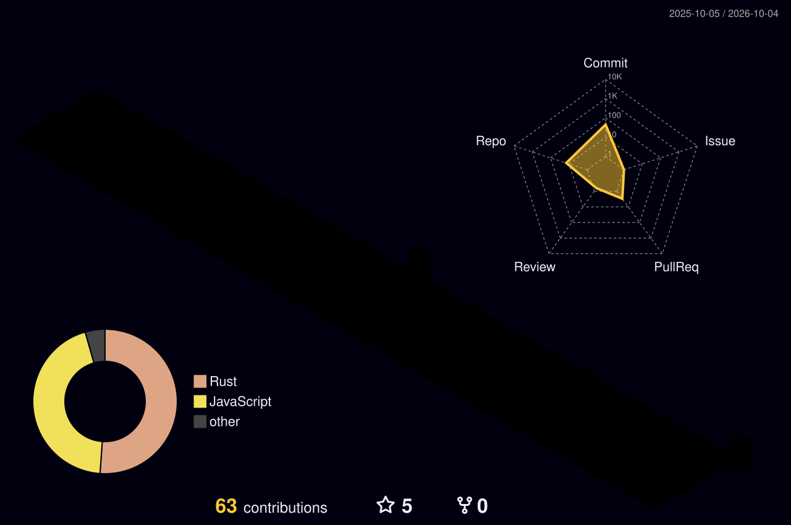

# 喵~ 我是 ApTx2012 👋

---

## 🧑💻 关于我

- 🔭 目前在做：[Starlight_Launcher](https://github.com/ApTx2012/Starlight_Lancher)
- 🌱 正在学：Rust, TypeScript
- 💬 可以问我：Rust, Git, Python
- ⚡ 冷知识：这家伙是个人

---

## 🛠️ 技术栈

---

## 💪 技能熟练度

---

## 📊 GitHub 统计

---

## 🌈 3D 贡献图

---

## 🐍 贡献贪吃蛇

---

## 📂 项目经历

点开看我的项目

### 🎮 Starlight_Launcher

一个 Minecraft 启动器。

- 技术栈：Rust + TypeScript
- 仓库：[Starlight_Lancher](https://github.com/ApTx2012/Starlight_Lancher)

### 📦 [项目名]

[一句话描述]

- 技术栈：[...]
- 仓库：[链接]

---

## 📈 徽章

---

## 🔗 找到我

---

  

